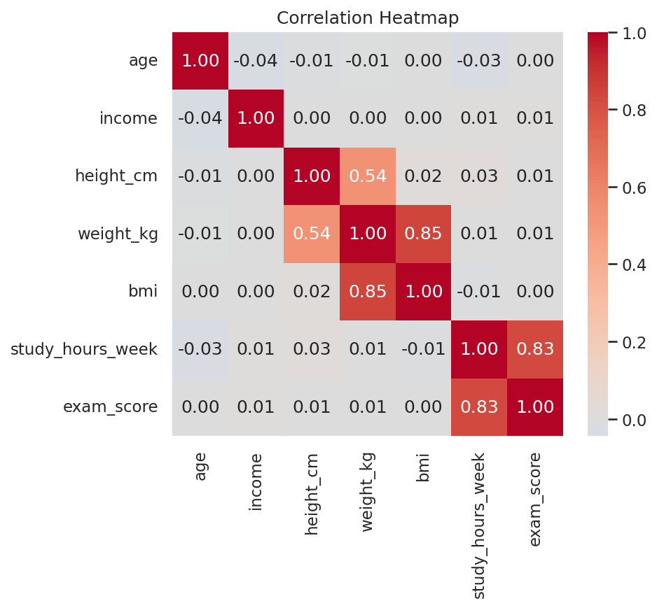

# 📊 Statistical Analysis Portfolio Project

A complete, end-to-end statistical analysis project on a synthetic dataset
designed to cover every major variable type and statistical test commonly
used in applied data analysis — from data cleaning to hypothesis testing
to regression modeling, all in Python.

## 🎯 Project Goals

- Apply core statistical concepts to a realistic, messy dataset
- Choose the right test based on data type and distribution (parametric vs
  non-parametric), and report the matching effect size for every test
- Write clean, modular, reusable Python code rather than one long notebook
- Communicate results clearly with visualizations and plain-language interpretation

## 🗂️ Project Structure

```
final-project/
├── data/
│   ├── generate_raw_dataset.py    # script that generates the synthetic raw data
│   ├── raw_dataset.csv            # 2,000 rows x 22 columns, intentionally messy
│   └── cleaned_dataset.csv        # final cleaned dataset used in the analysis
├── notebooks/
│   └── statistical_analysis.ipynb # main analysis notebook (the report)
├── src/
│   ├── data_cleaning.py           # missing values, outliers, type fixes - fully documented
│   ├── descriptive_stats.py       # summary statistics
│   ├── hypothesis_tests.py        # t-tests, ANOVA, chi-square, correlation, effect sizes
│   ├── regression.py              # linear & logistic regression
│   └── visualization.py           # reusable plotting functions
├── outputs/figures/                # saved charts (.png)
├── requirements.txt
└── README.md
```

## 📦 Dataset Overview

The dataset is fully synthetic (generated with `data/generate_raw_dataset.py`),
so the project is reproducible and free of any privacy concerns.

| Variable type | Columns | Purpose |
|---|---|---|
| Nominal | gender, education, city, treatment, group, smoker, has_disease | Chi-square, group comparisons |
| Continuous (normal) | age, height_cm, weight_kg, bmi, score_before/after, performance | t-tests, ANOVA, correlation |
| Continuous (skewed) | income, study_hours_week | Normality testing, transformation |
| Ordinal | job_satisfaction_1to5 | Non-parametric handling |
| Count | children_count | Poisson-like distribution |
| Binary | passed_exam | Logistic regression |
| Date | register_date | Time-based grouping |

The raw dataset intentionally contains missing values, outliers, and a
few impossible values (negative exam scores) to practice real-world data
cleaning. `src/data_cleaning.py` documents, step by step, exactly how each
issue was investigated and resolved (including why some statistical
outliers were corrected and others were left alone after checking
real-world plausibility).

## 🧪 Research Questions & Methods

| # | Question | Variables | Test(s) | Effect size |
|---|---|---|---|---|
| 1 | Does the drug improve scores vs placebo? | treatment, score_after | Independent t-test, Mann-Whitney U | Cohen's d |
| 2 | Did scores change before → after? | score_before, score_after | Paired t-test, Wilcoxon | Cohen's d (paired) |
| 3 | Does performance differ across groups A/B/C? | group, performance | One-way ANOVA, Tukey HSD | Eta squared |
| 4 | Is smoking associated with disease? | smoker, has_disease | Chi-square | Cramer's V |
| 5 | Does study time relate to exam score? | study_hours_week, exam_score | Pearson, Spearman | r / rho |
| 6 | Predicting exam score | study_hours_week, age | Linear regression (simple & multiple) | R² |
| 7 | Predicting exam pass/fail | exam_score, study_hours_week | Logistic regression | Odds ratios |

Every hypothesis test follows the same workflow: check normality first
(Shapiro-Wilk), run both the parametric and non-parametric version when
the result is borderline, then report the matching effect size — not
just the p-value — since statistical significance and practical
importance are two different things, especially with a large sample size.

## 🚀 How to Run

```bash
git clone <your-repo-url>
cd final-project
pip install -r requirements.txt
jupyter notebook notebooks/statistical_analysis.ipynb
```

The notebook imports all logic from `src/`, so each method can also be
reused independently:

```python
from src.hypothesis_tests import independent_ttest, cohens_d_independent
result = independent_ttest(group_a, group_b)
d = cohens_d_independent(group_a, group_b)
```

## 📈 Sample Output



## 🛠️ Tech Stack

`Python` · `pandas` · `numpy` · `scipy` · `statsmodels` · `pingouin` · `matplotlib` · `seaborn` · `Jupyter`

## 📝 Notes on data quality

While building this project, a bug was found in the original
data-generation script: `weight_kg` was clipped to a floor of 45 kg for
about 82% of rows, producing an unrealistic, non-normal distribution.
This was traced back to the generation formula itself and fixed at the
source (`fix_weight_and_bmi` in `src/data_cleaning.py`), regenerating
both `weight_kg` and `bmi` from a realistic baseline BMI distribution.
This is documented here because diagnosing and fixing this kind of
upstream data issue — rather than just "cleaning around it" — is itself
a core data analysis skill.

## 📄 License

MIT License — feel free to use this project structure for your own learning.
